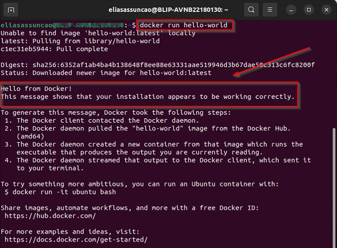
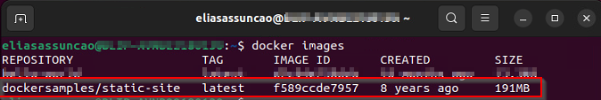
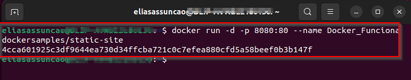
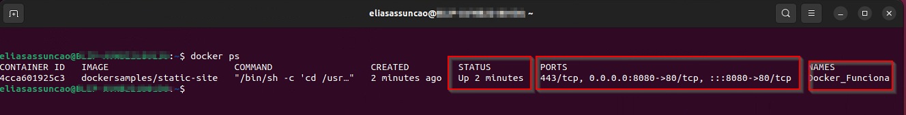
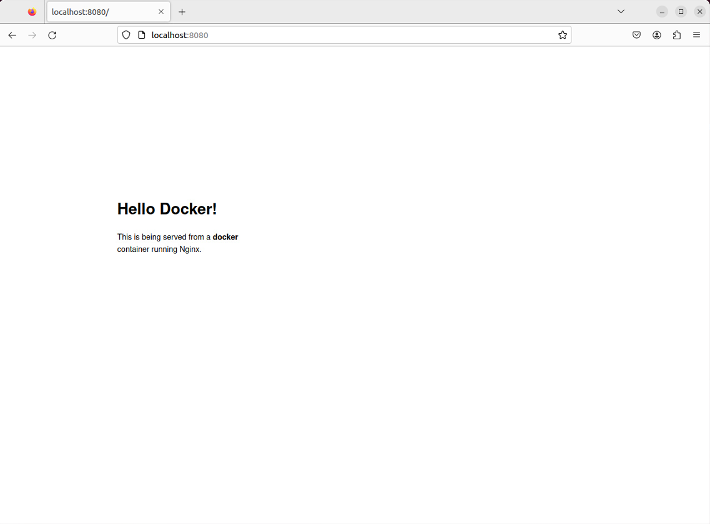

# Demonstração simples do docker rodando um site estatico via nginx 


**Objetivo**:

Esta atividade tem como objetivo demonstrar o funcionamento do Docker de forma simples e direta. Iremos hospedar um site estático usando uma imagem disponível no Docker Hub. Inicialmente, não faremos muitas customizações, apenas configuraremos o redirecionamento de portas e carregaremos o template do site disponível na imagem.


## 📌 Requisitos

Certifique-se de ter o Docker instalado no seu sistema. Se necessário, você pode seguir o link da documentação oficial [Como instalar o Docker](https://docs.docker.com/engine/install/)


## 📦 Documentação

**Verificar se temos o docker**

Para verificar se o Docker está instalado no seu sistema, você pode usar o seguinte comando no terminal:

```
docker run hello-world
```



**Baixar a imagem docker**

Para simplificar o processo, vamos utilizar uma imagem Docker disponível no Docker Hub. Isso significa que não precisaremos criar uma imagem personalizada, mas sim baixar e usar uma imagem pronta disponibilizada por outros usuários.

```
docker pull dockersamples/static-site

```


Para verificar se a imagem está corretamente presente em nosso dispositivo, você pode usar um comando para listar as imagens Docker.

```
docker images
```




**Subindo o container e redirecionando as portas**

Para iniciar o contêiner, usaremos o comando `docker run`, seguido da opção `-d` para não cair na forma interativa, e da opção `-p` para redirecionar a porta 8080 do host para a porta 80 do contêiner. Em seguida, usaremos a opção `--name` para atribuir um nome ao contêiner e, por último, passaremos o nome da imagem que baixamos anteriormente.

```
docker run -d -p 8080:80 --name Docker_Funciona dockersamples/static-site
```



Para verificar se nosso container foi criado e esta sendo executa basta dar o seguinte comando


```
docker ps
```
Dessa forma você tem acesso não somente ao STATUS, mas a varias informações importantes




## ✔️ O Docker Funciona ??

Para verificar se nosso site subiu corretamente, basta acessar o navegador e digitar localhost:8080




# Quer aprendar mais?

Tenho um repositorio de [Estudos](https://github.com/Hooligam/Estudos/tree/main/Docker) sobre Docker, que tal da uma 👀 e aprendar um pouco mais.


⌨️ com ❤️ por [Elias Assunção](https://github.com/Hooligam) 🔥
